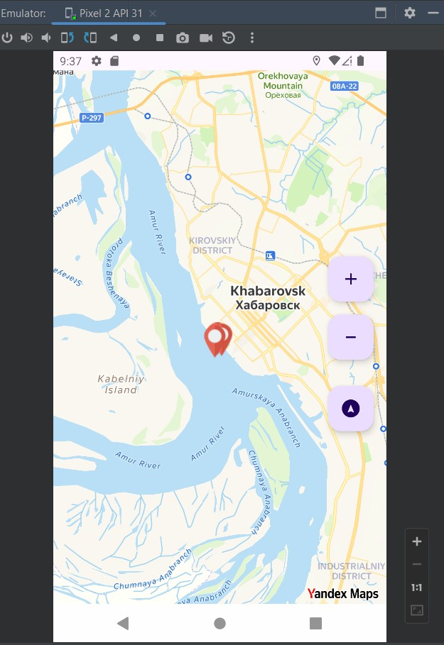

# Урок 19. Работа с геопозиционированием

### Цель практической работы:
Применить знания по Location и научиться работать с картой.

### Что нужно сделать:

Создайте отдельное мини-приложение «Достопримечательности 2.0» или добавьте ещё один экран с картой 
достопримечательностей к написанному ранее приложению.

1. Создайте экран с картой. В качестве альтернативы Google Maps вы можете использовать 
   Yandex Map Kit или Open Street Map.
2. Сделайте так, чтобы на этом экране отображалось текущее местоположение пользователя на карте.
3. Расположите на карте достопримечательности, используя маркеры. Чтобы это сделать, нужны данные 
   о достопримечательностях. Сделайте список самостоятельно или загрузите по API 
   (например, используйте OpenTripMap API).
4. Сделайте так, чтобы при нажатии на маркер открывалось заполненное информационное окно в «Информация по объекту».
5. Сделайте так, чтобы на экране отображались кнопки масштабирования и текущего местоположения.

==================================================================================

## Демонстрация решения:

